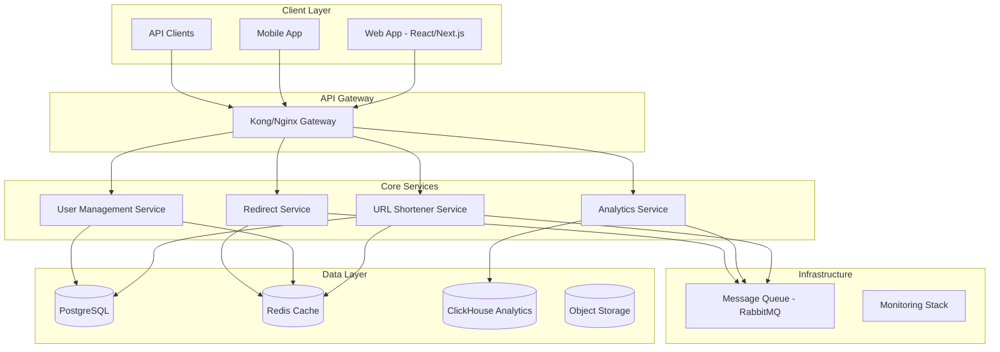

# Design Document

## Overview

A plataforma de encurtamento de URL será construída usando uma arquitetura de microserviços moderna, priorizando performance, segurança e observabilidade. O sistema será composto por serviços especializados que trabalham em conjunto para fornecer encurtamento de URLs, analytics em tempo real e uma experiência de usuário otimizada.

## Architecture

### High-Level Architecture



### Technology Stack

**Backend:**
- Node.js/TypeScript com Express.js ou Fastify
- PostgreSQL para dados relacionais (usuários, URLs)
- Redis para cache e sessões
- ClickHouse para analytics de alta performance
- RabbitMQ para processamento assíncrono

**Frontend:**
- React com Next.js para SSR/SSG
- TypeScript para type safety
- Tailwind CSS para styling
- Chart.js/D3.js para visualizações
- React Query para state management

**Infrastructure:**
- Docker containers
- Kubernetes para orquestração
- Kong ou Nginx como API Gateway
- Prometheus + Grafana para monitoramento
- ELK Stack para logs

## Components and Interfaces

### URL Shortener Service

**Responsabilidades:**
- Gerar códigos únicos para URLs
- Validar e sanitizar URLs de entrada
- Gerenciar CRUD de URLs encurtadas
- Implementar rate limiting por usuário

**APIs:**
```typescript
interface URLShortenerAPI {
  // POST /api/v1/urls
  createShortUrl(request: CreateUrlRequest): Promise<ShortUrlResponse>
  
  // GET /api/v1/urls
  getUserUrls(userId: string, pagination: PaginationParams): Promise<UrlListResponse>
  
  // PUT /api/v1/urls/:id
  updateUrl(id: string, updates: UpdateUrlRequest): Promise<ShortUrlResponse>
  
  // DELETE /api/v1/urls/:id
  deleteUrl(id: string): Promise<void>
}
```

### Redirect Service

**Responsabilidades:**
- Processar redirecionamentos com latência mínima
- Registrar eventos de clique para analytics
- Implementar cache distribuído
- Detectar e bloquear URLs maliciosas

**Otimizações:**
- Cache L1: In-memory cache (Node.js)
- Cache L2: Redis distribuído
- Cache L3: CDN edge locations
- Pré-carregamento de URLs populares

### Analytics Service

**Responsabilidades:**
- Processar eventos de clique em tempo real
- Gerar relatórios e dashboards
- Implementar agregações eficientes
- Fornecer APIs para visualizações

**Métricas Coletadas:**
```typescript
interface ClickEvent {
  shortUrlId: string
  timestamp: Date
  ipAddress: string
  userAgent: string
  referrer: string
  country: string
  city: string
  device: DeviceInfo
  browser: BrowserInfo
}
```

### User Management Service

**Responsabilidades:**
- Autenticação e autorização
- Gerenciamento de perfis
- Rate limiting por usuário
- Conformidade com LGPD/GDPR

## Data Models

### PostgreSQL Schema

```sql
-- Users table
CREATE TABLE users (
  id UUID PRIMARY KEY DEFAULT gen_random_uuid(),
  email VARCHAR(255) UNIQUE NOT NULL,
  password_hash VARCHAR(255) NOT NULL,
  name VARCHAR(255),
  created_at TIMESTAMP DEFAULT NOW(),
  updated_at TIMESTAMP DEFAULT NOW(),
  is_active BOOLEAN DEFAULT true
);

-- Short URLs table
CREATE TABLE short_urls (
  id UUID PRIMARY KEY DEFAULT gen_random_uuid(),
  user_id UUID REFERENCES users(id),
  original_url TEXT NOT NULL,
  short_code VARCHAR(10) UNIQUE NOT NULL,
  title VARCHAR(255),
  tags TEXT[],
  is_active BOOLEAN DEFAULT true,
  expires_at TIMESTAMP,
  created_at TIMESTAMP DEFAULT NOW(),
  updated_at TIMESTAMP DEFAULT NOW()
);

-- Create indexes for performance
CREATE INDEX idx_short_urls_code ON short_urls(short_code);
CREATE INDEX idx_short_urls_user_id ON short_urls(user_id);
CREATE INDEX idx_short_urls_created_at ON short_urls(created_at);
```

### ClickHouse Analytics Schema

```sql
-- Click events table (ClickHouse)
CREATE TABLE click_events (
  short_url_id String,
  timestamp DateTime64(3),
  ip_address String,
  user_agent String,
  referrer String,
  country String,
  city String,
  device_type String,
  browser String,
  os String
) ENGINE = MergeTree()
ORDER BY (short_url_id, timestamp)
PARTITION BY toYYYYMM(timestamp);

-- Materialized views for aggregations
CREATE MATERIALIZED VIEW daily_stats AS
SELECT 
  short_url_id,
  toDate(timestamp) as date,
  count() as clicks,
  uniq(ip_address) as unique_visitors
FROM click_events
GROUP BY short_url_id, date;
```

### Redis Cache Structure

```typescript
// URL cache (TTL: 1 hour)
"url:{shortCode}" -> {
  originalUrl: string,
  userId: string,
  isActive: boolean,
  expiresAt?: Date
}

// User session cache (TTL: 24 hours)
"session:{sessionId}" -> {
  userId: string,
  email: string,
  permissions: string[]
}

// Rate limiting (TTL: 1 minute)
"rate_limit:{userId}:{endpoint}" -> {
  count: number,
  resetTime: Date
}
```

## Error Handling

### Error Response Format

```typescript
interface ErrorResponse {
  error: {
    code: string
    message: string
    details?: any
    timestamp: string
    requestId: string
  }
}
```

### Error Categories

1. **Validation Errors (400)**
   - Invalid URL format
   - Missing required fields
   - Invalid parameters

2. **Authentication Errors (401/403)**
   - Invalid credentials
   - Expired tokens
   - Insufficient permissions

3. **Rate Limiting (429)**
   - Too many requests
   - Quota exceeded

4. **System Errors (500)**
   - Database connection failures
   - External service timeouts
   - Unexpected exceptions

### Circuit Breaker Pattern

Implementar circuit breakers para:
- Conexões com banco de dados
- Chamadas para serviços externos
- APIs de geolocalização
- Serviços de analytics

## Testing Strategy

### Unit Testing
- Cobertura mínima de 80%
- Testes para todas as funções de negócio
- Mocking de dependências externas
- Testes de validação de dados

### Integration Testing
- Testes de APIs end-to-end
- Testes de integração com banco de dados
- Testes de cache Redis
- Testes de message queues

### Performance Testing
- Load testing com 10,000 RPS
- Stress testing para identificar limites
- Testes de latência de redirecionamento (<100ms)
- Testes de throughput de analytics

### Security Testing
- Testes de penetração automatizados
- Validação de rate limiting
- Testes de injection attacks
- Auditoria de dependências

## Security Implementation

### Authentication & Authorization
```typescript
// JWT payload structure
interface JWTPayload {
  userId: string
  email: string
  permissions: string[]
  iat: number
  exp: number
}
```

### Rate Limiting Strategy
- 100 requests/minute para usuários autenticados
- 20 requests/minute para usuários anônimos
- 1000 URLs/dia por usuário gratuito
- Rate limiting distribuído usando Redis

### Data Protection
- Criptografia AES-256 para dados sensíveis
- Hashing bcrypt para senhas (cost factor 12)
- Sanitização de URLs para prevenir XSS
- Validação rigorosa de entrada

## Monitoring and Observability

### Metrics (Prometheus)
```yaml
# Business metrics
url_shortener_urls_created_total
url_shortener_redirects_total
url_shortener_active_users_gauge

# Technical metrics
http_requests_duration_seconds
database_connections_active
cache_hit_ratio
queue_messages_processed_total
```

### Distributed Tracing
- OpenTelemetry para instrumentação
- Jaeger para visualização de traces
- Correlação de logs com trace IDs
- Performance profiling automático

### Alerting Rules
```yaml
# High error rate
- alert: HighErrorRate
  expr: rate(http_requests_total{status=~"5.."}[5m]) > 0.1
  
# High response time
- alert: HighResponseTime
  expr: histogram_quantile(0.95, http_request_duration_seconds) > 1.0
  
# Database connection issues
- alert: DatabaseConnectionLow
  expr: database_connections_active < 5
```

### Health Checks
```typescript
interface HealthCheck {
  status: 'healthy' | 'degraded' | 'unhealthy'
  checks: {
    database: HealthStatus
    redis: HealthStatus
    messageQueue: HealthStatus
    externalAPIs: HealthStatus
  }
  timestamp: string
}
```